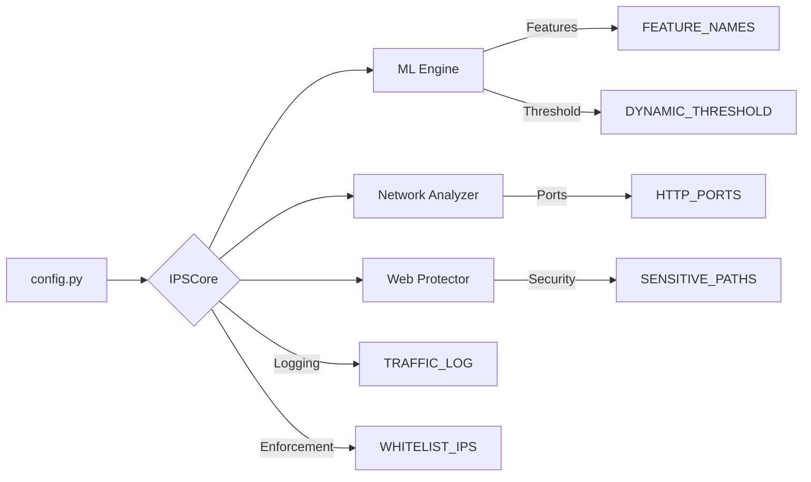

### 1. Modèle Machine Learning 🧠
```python
# config.py
'MODEL_PATH': "/path/autoencoder_model.keras",
'SCALER_MEAN_PATH': "/path/scaler_mean.npy",
'SCALER_SCALE_PATH': "/path/scaler_scale.npy",
'TRAINING_ERRORS_PATH': "/path/training_errors.npy",
'DYNAMIC_THRESHOLD': 5,
'FEATURE_NAMES': [...] # 78 caractéristiques
```

**Intégration dans le code** :
- `init_model()` : Charge le modèle et les paramètres de normalisation
- `extract_features()` : Utilise `FEATURE_NAMES` pour structurer les données
- `analyze_packet()` : Calcule le MSE avec `(scaled - reconstructed)²`
```python
# Seuil dynamique calculé comme :
threshold = CONFIG['DYNAMIC_THRESHOLD'] * np.percentile(training_errors, 95)
```

### 2. Détection Network Layer 🌐
```python
# config.py
'PORT_SCAN_THRESHOLD': 5,
'PORT_SCAN_INTERVAL': 2,
'SYN_THRESHOLD': 10,
'HTTP_PORTS': [80, 8080],
'KNOWN_PORTS': [8080],
'MAX_PACKET_SIZE': 1500,
```

**Mécanismes associés** :
- Tracking des ports dans `port_scan_stats` (deque)
- Calcul de la taille des paquets :
```python
# ips_main.py
features[' Packet Length Mean'] = len(packet) / CONFIG['MAX_PACKET_SIZE']
```
- Détection SYN Flood :
```python
if self.syn_stats[ip]['count'] > CONFIG['SYN_THRESHOLD']:
    self.block_ip(ip, "SYN Flood")
```

### 3. Web Application Protection 🛡️
```python
# config.py
'SENSITIVE_PATHS': ['/admin', '/wp-login.php'],
'USER_AGENT_BLACKLIST': ['sqlmap', 'hydra'],
'MAX_FAILED_LOGINS': 5,
'BRUTEFORCE_WINDOW': 10,
'WEB_SERVER_PORT': 8080,
```

**Fonctionnalités clés** :
- Détection d'accès aux chemins sensibles :
```python
# analyze_http()
if any(sensitive_path in path for sensitive_path in CONFIG['SENSITIVE_PATHS']):
    self.track_sensitive_access(ip)
```
- Vérification des User-Agents :
```python
if any(ua in request.headers.get('User-Agent','') for ua in CONFIG['USER_AGENT_BLACKLIST']):
    self.block_ip(ip, "Bad User-Agent")
```

### 4. Gestion des Risques 📈
```python
# config.py
'BLOCK_THRESHOLD': 2.0,
'ML_THRESHOLD': 200,
'MAX_REQUEST_RATE': 10,
```

**Système de scoring** :
- Augmentation contextuelle des scores :
```python
# update_risk_score()
self.scores[ip] += {
    'Port Scan': 0.4,
    'ML Anomaly': 0.6,
    'Bruteforce': 2.0
}[reason]
```
- Vérification combinée :
```python
if (self.scores[ip] >= CONFIG['BLOCK_THRESHOLD'] 
   or mse > CONFIG['ML_THRESHOLD'] 
   or request_rate > CONFIG['MAX_REQUEST_RATE']):
    self.block_ip(ip)
```

### 5. Journalisation & Debug 📝
```python
# config.py
'TRAFFIC_LOG': "/path/traffic_logs.csv",
'DEBUG_MODE': True,
'WEB_LOG': "/path/web_logs.csv",
```

**Workflow de logging** :
```python
# log_event()
headers = {
    'TRAFFIC_LOG': ['Timestamp', 'Source_IP', ...],
    'WEB_LOG': ['Timestamp', 'IP', 'Username', 'Password']
}
writer.writerow(headers[log_type])
```

### 6. Architecture Réseau 🖧
```python
# config.py
'WHITELIST_IPS': ['127.0.0.0/8', '192.168.133.213/32'],
'MONITORED_IP': "192.168.133.213",
```

**Vérifications réseau** :
```python
# block_ip()
if ipaddress.ip_address(ip) in ipaddress.ip_network(subnet):
    return False  # Whitelist

# extract_features()
if ip.dst == CONFIG['MONITORED_IP']:
    self.bwd_packets.append(...)
```

### 7. Modèle de Détection SQLi 🕳️
```python
# config.py
'ML_DEVICE': -1  # CPU
```

**Intégration Hugging Face** :
```python
# SQLiDetector.__init__()
self.classifier = pipeline(
    "text-classification", 
    model="semgohq/sql-injection",
    device=CONFIG['ML_DEVICE']
)
```

### Schéma d'Interaction Global 🔄

